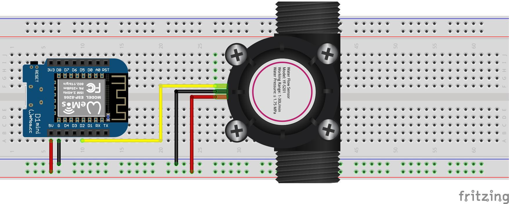

# bFlowSensors GPIO Library
## Overview
Mongoose-OS library that allows you to easily attach a [bFlowSensor](https://github.com/diy365-mgos/bflowsens) to a GPIO for measuring signal frequency and calculating the flow rate and the total flow volume.
## GET STARTED
### Hardware
Bill of materials:
* Wemos D1 Mini board
* YF-S201 flow meter

</img>
### Firmware
Add these configurations to your `mos.yml` file.
```yaml
libs:
  - origin: https://github.com/mongoose-os-libs/boards
  - origin: https://github.com/diy365-mgos/bflowsens-gpio
```
Copy and paste this firmware code into your `main.c` file.
```c
#include "mgos.h"
#include "mgos_bflowsens.h"
#include "mgos_bflowsens_gpio.h"

static void flow_state_changed_cb(int ev, void *ev_data, void *userdata) {
  struct mgos_bthing_state* data = (struct mgos_bthing_state*)ev_data;
  mgos_bthing_t thing = data->thing;
  mgos_bvarc_t state = data->state;

  LOG(LL_INFO, ("'%s' flow rate: %.2f | total flow: %.2f ",
    mgos_bthing_get_uid(thing),
    mgos_bvar_get_decimal(mgos_bvarc_get_key(state, "flowRate")),
    mgos_bvar_get_decimal(mgos_bvarc_get_key(state, "totalFlow"))));
}

enum mgos_app_init_result mgos_app_init(void) {
  mgos_event_add_handler(MGOS_EV_BTHING_STATE_CHANGED, flow_state_changed_cb, NULL);

  // create the flow sesnsor
  mgos_bflowsens_t f1 = mgos_bflowsens_create("flow1", NULL);
  // attach the flow sensor to the pin 4(D2)
  mgos_bflowsens_gpio_attach(f1, 4, MGOS_GPIO_PULL_NONE, true, 7.5);

  return MGOS_APP_INIT_SUCCESS;
}
```
## C/C++ APIs Reference
### mgos_bflowsens_gpio_attach
```c
bool mgos_bflowsens_gpio_attach(mgos_bflowsens_t sensor, 
                                  int pin, enum mgos_gpio_pull_type pull_type,
                                  bool high_pulse, float flow_ratio);
```
Initializes the GPIO and attaches it to a bFlowSensor. Returns `true` on success, or `false` otherwise. 

|Parameter||
|--|--|
|sensor|A bFlowSensor.|
|pin|The GPIO pin.|
|pull_type|The GPIO [pull type](https://mongoose-os.com/docs/mongoose-os/api/core/mgos_gpio.h.md#mgos_gpio_set_pull).|
|high_pulse|`true` if GIPO's pulses are positive (0 ot 1) pulses, `false` otherwise.|
|flow_ratio|The flow ratio. See *Remarks* below for more details.|

**Remarks**

The `flow_ratio` parameter depends on the physical flow sensor and it is usually provided in the manufacturer's datasheet. For example:
```
Flow ratio: 7.5
```
Sometime the datasheet reports the formula `F(Hz) = K * Q(L/min)` where `K` is the flaw rate value. For example:
```
Frequency: (Hz) = 7.5 * Q(L/min) ± 5%
```
## To Do
- Implement javascript APIs for [Mongoose OS MJS](https://github.com/mongoose-os-libs/mjs).
